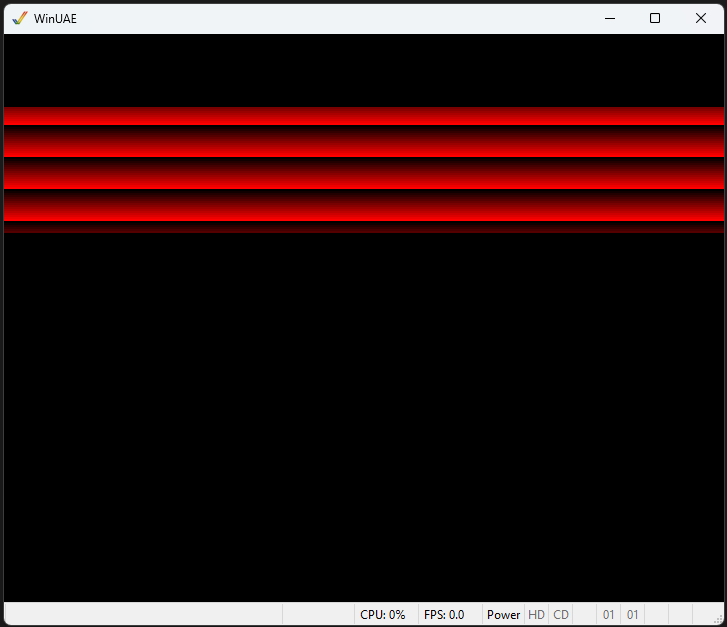

# 003 - Computer Copper

This example extends 002-vertical-blank-interrupt and extends it to add a background colour animation.

Part of the copper list is generated by the code. 
A block of memory is reserved by the assembler, and a routine generates the copper wait and background colour bar creation.

The vertical blank interrupt handler is executed once per frame. 
It called the code to regenerate the copper bars and animate the colours.

Code is not optimal, this is a learning aid.

 

