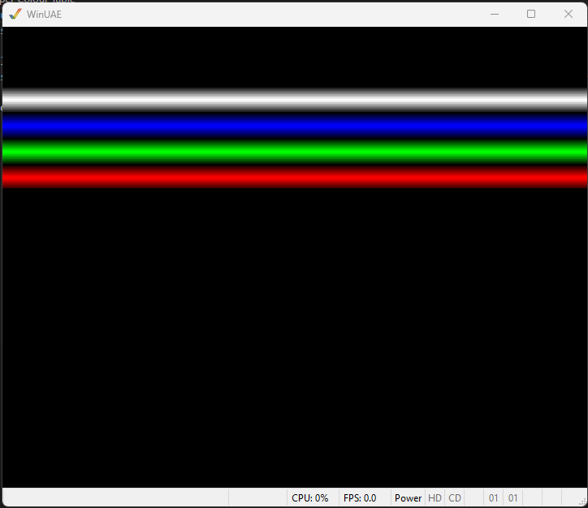

# 004 - Copper Colour Table

This example extends 003-computed-copper and extends it to read the background colour from a table of values.

Part of the copper list is generated by the code. 
A block of memory is reserved by the assembler, and a routine generates the copper wait and background colour bar creation.

There is no animation on this example. It demonstrates code to read data from a table.
 

