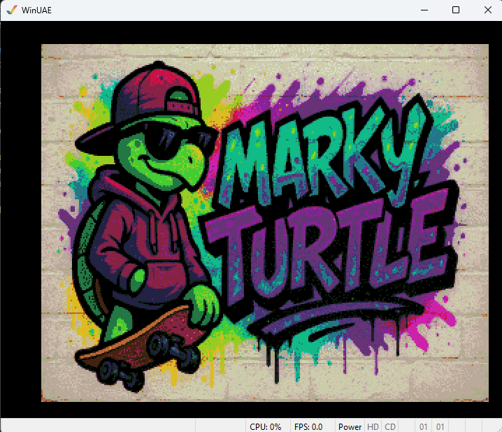

# 100 - Simple Bitplane

This example extends the '100 - Simple Bitplane' project and displays a simple 5 bitplane logo at 320x256 resolution (PAL)

It uses the information learned in the Copper examples and extends it to display a standard lo-res 320x256 PAL bitplane screen, and 
also details regarding reading colour details from a table of data and updating the copper list using the 68000 program.

The Amiga uses the Copper to set the memory address of the bitplane DMA pointers everytime the display is refreshed.
(i.e. 50 times per second on a PAL machine, 60 times per second on an NTSC machine)

The harware reference manual contains details of the standard settings required for displaying the standard resolution screens on the Amiga for both PAL and NTSC.

NB: It's worth spending some time to understand how the DDFSTART/DDFSTOP (DMA Start/Stop) and DIWSTART/DIWSTOP(Window placement) work together to form a stable display.
These details can be found in the Hardware Reference Manual and other publications on the internet. I may expand the docs to explain these in future, but for now i'm collating some example code to get things moving along.

NB: I'll admit to cheating on the creation of the logo. I have no artistic friends and my abiliy sucks! The logo is AI generated.

