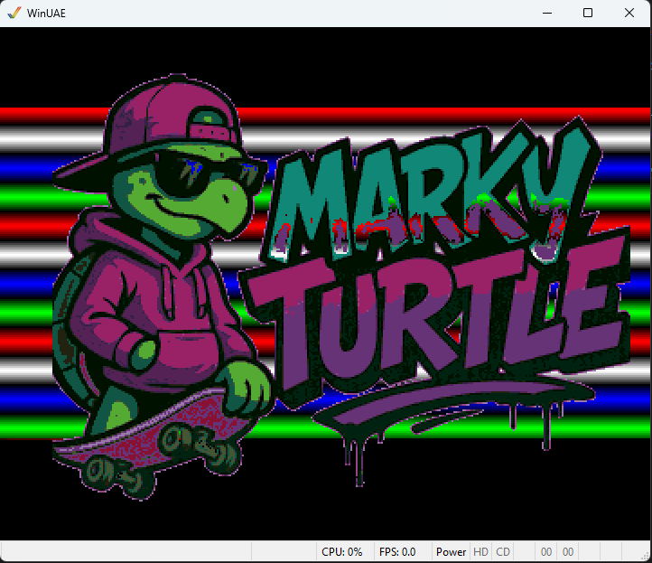

# 102 - Colourful Bitplane with Copper Bars

This example extends the '101 - Colourful Bitplane' project and displays a simple 5 bitplane logo at 384x256 resolution (PAL)

The Bitplane is 8 bytes wider (48 bytes) than the screen display (40 bytes), and so the MODULO values are set to $0008 to skip
8 bytes at the end of each scanline to allow the image to display correctly.

It uses the information learned in the Copper examples and extends it to display a standard lo-res 320x256 PAL bitplane screen, and 
also details regarding reading colour details from a table of data and updating the copper list using the 68000 program.

It incorporates the earlier Copper code examples to display a set of animated copper bars behind the image being displayed, and
scroll them with a sine wave using the Vertical Blank Interrupt.
