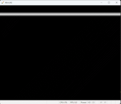
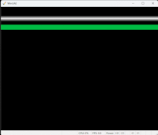
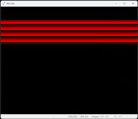
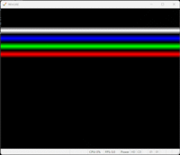
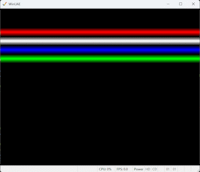
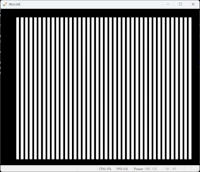
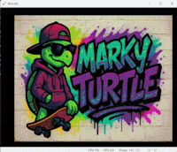
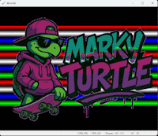

# Amiga Programming - 68000 Assembler
This is intended as a guide to programming the Amiga computer in 68000 assembler.

It assumes that you are using VSCode and have the Amiga Assembly plug-in installed. All examples will be contained in sub-folders that use the project structure suitable for these tools.

- [VSCode Editor](https://code.visualstudio.com/)
- [Amiga Assembly Plug-in GitHub](https://github.com/prb28/vscode-amiga-assembly)

## Example Projects

### Simple Copper List
- [001 - Simple Copper](./001-simple-copper/)
- 

### Simple Copper List + Vertical Blank Interrupt
- [002-vertical-blank-interrupt](./002-vertical-blank-interrupt/)
- 

### Computed Copper List
- [003-computed-copper](./003-computed-copper/)
- 

### Copper List + Colour Table
- [004-copper-colour-table](./004-copper-colour-table/)
- 

### Copper List + Colour Table + Animation
- [005-copper-colour-table-animation](./005-copper-colour-table-animation/)
- 

### Simple Bitplane
- [100-simple-bitplane](./100-simple-bitplane/)
- 

### Colourful Bitplane (Planar)
- [101-colourful-bitplane](./101-Colourful-bitplane-planar/)
- 

### Colourful Bitplane (Planar) + Copper Bar Animation
- [102-colourful-bitplane-planar-copper](./102-Colourful-bitplane-planar-copper/)
- 
